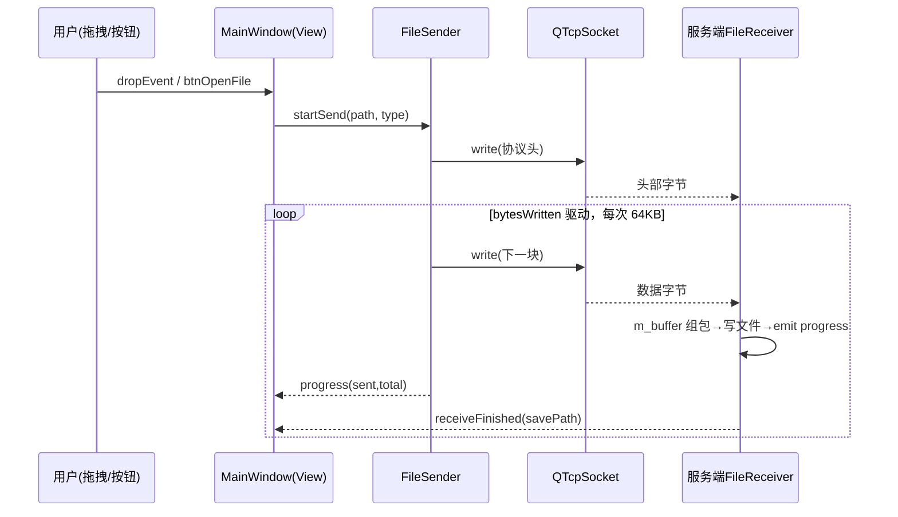

# 基于 Qt 的 Socket 文件传输工具 — 设计文档

> 对应需求文档：`docs/01-requirement.md`
> 开发环境：C++ / Qt 6 / Qt Creator，网络模块使用 QTcpSocket 与 QTcpServer

---

## 1. 概述

本项目实现一个基于 TCP Socket 的文件传输工具，包含**客户端**与**服务端**两个可执行程序（同一 Qt 工程下的两个 subdirs 子项目）。支持文本文件（.txt 等）与图片文件（.png / .jpg / .bmp 等）的可靠传输，具有自定义协议头分包组包、拖拽发送/保存、进度条展示、日志显示、连接设置对话框等功能。

客户端与服务端功能对称：双方都可以发送和接收文件（全双工）。为简化实现，采用 **客户端 ↔ 服务端** 各自持有 `QTcpSocket`/`QTcpServer` 的对等连接模型。

---

## 2. 总体架构

### 2.1 架构分层

按照"UI 显示（View）与网络通信逻辑（Model）适度分离"的要求，分为三层：

```
┌─────────────────────────────────────────────┐
│  View 层                                     │
│  MainWindow (.ui) / SettingsDialog (.ui)     │
│  只负责界面展示与用户交互，不直接操作 Socket   │
└───────────────┬─────────────────────────────┘
                │ 信号与槽（QString/QVariant 参数）
┌───────────────▼─────────────────────────────┐
│  Control / 传输管理层                         │
│  TransferManager（会话管理、协议解析调度）      │
│  FileSender（文件发送，write+bytesWritten 流水线）│
│  FileReceiver（文件接收、组包落盘）             │
└───────────────┬─────────────────────────────┘
                │
┌───────────────▼─────────────────────────────┐
│  Network 层                                  │
│  QTcpServer / QTcpSocket                     │
│  Packet 定义（协议常量、封包/解包工具函数）      │
└─────────────────────────────────────────────┘
```

### 2.2 工程目录结构

```
File_transfer_tool/
├── FileTransferTool.pro          # 顶层 SUBDIRS 工程
├── common/                       # 公共库（客户端服务端共用）
│   ├── common.pri
│   ├── packet.h / packet.cpp     # 协议定义与封包/解包
│   ├── file_sender.h / .cpp      # 文件发送器
│   └── file_receiver.h / .cpp    # 文件接收器
├── client/
│   ├── client.pro                # QT += network widgets
│   ├── main.cpp
│   ├── mainwindow.h / .cpp       # 重写 dragEnterEvent / dropEvent
│   ├── mainwindow.ui
│   ├── settingsdialog.h / .cpp   # 连接设置对话框
│   ├── settingsdialog.ui
│   ├── resources.qrc             # 图标资源
│   └── style.qss                 # QSS 样式表（qrc 加载）
└── server/
    ├── server.pro
    ├── main.cpp
    ├── mainwindow.h / .cpp
    ├── mainwindow.ui
    ├── settingsdialog.h / .cpp   # 监听端口、保存路径设置
    ├── settingsdialog.ui
    ├── resources.qrc
    └── style.qss
```

顶层 `.pro` 内容（关键部分）：

```qmake
TEMPLATE = subdirs
SUBDIRS += common client server
```

---

## 3. 通信协议设计（分包与粘包处理）

### 3.1 协议头格式

自定义固定长度协议头 + 变长载荷，所有多字节整数统一使用**小端序** `qint32` / `qint64`：

```
┌──────────┬────────────┬──────────────┬──────────────┬─────────────────┐
│ 消息类型  │ 文件名长度  │    文件名     │  文件大小(字节)│     文件数据     │
│ qint32 4B │ qint32 4B  │  变长 UTF-8   │  qint64 8B   │ 变长，可分多段到达│
└──────────┴────────────┴──────────────┴──────────────┴─────────────────┘
|<---------------------- 协议头 Header ------------------>|<- Payload ->|
```

- **消息类型**（枚举 `PacketType`）：
  - `0x0001 MSG_TEXT_FILE`：文本文件
  - `0x0002 MSG_IMAGE_FILE`：图片文件
  - `0x0003 MSG_CHAT`（可选扩展）：纯文本消息
- **文件名长度**：文件名 UTF-8 编码后的字节数（不含 `\0`）。
- **文件名**：如 `笔记.txt`、`photo.png`，仅取 `QFileInfo::fileName()`，防止传相对路径。
- **文件大小**：文件总字节数（qint64，支持大文件）。
- **文件数据**：跟在协议头后的二进制内容。

发送时**协议头与文件数据分两个 write 调用**先写入本地发送缓冲也可以合并为一次；本设计采用"头一次、数据流水线多次"的方式（见 3.3）。

### 3.2 接收端组包状态机（解决粘包/半包）

TCP 是字节流，一次 `readyRead` 读到的数据可能是半个包、一个包或多个包。接收端在 `FileReceiver` 内维护一个 `QByteArray m_buffer` 接收缓冲区，按以下状态机循环解析：

```
状态: WAIT_HEADER → WAIT_FILENAME → (校验) → WAIT_DATA → 完成 → 回到 WAIT_HEADER

WAIT_HEADER:
    已缓冲字节数 < 8 ?           → 继续等待 readyRead
    读出 type(4B) + nameLen(4B)  → nameLen 非法(<=0 或 >1MB)则视为协议错误，断开

WAIT_FILENAME:
    已缓冲 < nameLen ?           → 继续等待
    读出文件名                   → 记录

WAIT_DATA:
    协议头读完后再读 8B 得 fileSize；每次 readyRead 到来时把 m_buffer 中的
    剩余数据尽可能多地追加写入文件（限制单次写入块大小，如 64KB），
    已收字节 == fileSize 时 → 文件接收完成，发 finished 信号
    多个包粘在一起时，while 循环继续解析下一个包
```

关键点：
- 用 `QDataStream` 设定 `Qt_6_x` 版本从 `m_buffer` 头部读取定长字段，读完后 `m_buffer.remove(0, n)` 消费掉已解析字节。
- 文件数据不复制到独立缓冲，直接从 `m_buffer` 分块 `write` 到临时文件，收满后 `rename` 为目标文件名。
- 保存路径 = 设置对话框配置的目录 + 原文件名；重名时自动追加 `(1)`、`(2)` 后缀。

### 3.3 发送端流水线（避免一次 write 过大内存）

`FileSender` 不把整个文件读入内存，而是按 `bytesWritten` 信号驱动的流水线发送：

```
start(file):
    1. 打开文件（QFile::ReadOnly），失败则 emit error()
    2. 组装并发送协议头（type + nameLen + name + fileSize）一次 write
    3. m_bytesPending = fileSize
    onBytesWritten(n):
        m_bytesPending -= n
        emit progress(已发送, fileSize)      → 驱动 QProgressBar
        if m_bytesPending == 0: emit finished()
        else: 从文件读下一块 CHUNK=64*1024 字节 → socket->write(...)
```

- 每次最多写入一个 64KB 块，利用 Qt 内部写缓冲 + `bytesWritten` 信号节流，内存占用恒定。
- 槽函数与信号连接统一使用 `Qt::QueuedConnection` 语义（默认跨线程为队列连接；本项目单线程事件驱动即可）。

---

## 4. 类设计

### 4.1 common/packet.h（协议层）

| 成员/函数 | 说明 |
|---|---|
| `enum class PacketType : qint32` | 消息类型常量 |
| `struct PacketHeader` | type、nameLen、（name）、fileSize |
| `QByteArray makeHeader(type, fileName, fileSize)` | 序列化协议头 |
| `bool parseHeader(QByteArray&, PacketHeader&)` | 从缓冲解出定长字段 |

### 4.2 common/file_sender.h（发送管理）

```cpp
class FileSender : public QObject {
    Q_OBJECT
public:
    explicit FileSender(QTcpSocket *sock, QObject *parent = nullptr);
    bool startSend(const QString &filePath, PacketType type); // 入口：发头文件
signals:
    void progress(qint64 sent, qint64 total);   // 进度条
    void sendFinished(const QString &fileName); // 日志
    void sendError(const QString &msg);         // 状态栏/QMessageBox
private slots:
    void onBytesWritten(qint64 n);              // 流水线核心
private:
    QTcpSocket *m_socket;
    QFile m_file;  qint64 m_fileSize = 0, m_bytesPending = 0;
};
```

### 4.3 common/file_receiver.h（接收管理）

```cpp
class FileReceiver : public QObject {
    Q_OBJECT
public:
    explicit FileReceiver(QTcpSocket *sock, QObject *parent = nullptr);
    void setSaveDir(const QString &dir);        // 由设置对话框提供
signals:
    void receiveStarted(const QString &fileName, qint64 size);
    void progress(qint64 received, qint64 total);
    void receiveFinished(const QString &savedPath, PacketType type);
    void receiveError(const QString &msg);
private slots:
    void onReadyRead();                          // 状态机组包（见 3.2）
private:
    QTcpSocket *m_socket;  QByteArray m_buffer;  QString m_saveDir;
    QFile m_outFile;  PacketHeader m_cur{};  qint64 m_got = 0;
    int m_state = WAIT_HEADER;
};
```

### 4.4 client/mainwindow（客户端主窗口）

职责：
- 持有 `QTcpSocket`，提供"连接 / 断开 / 选择文件发送 / 拖拽发送"操作。
- 重写虚函数（体现事件处理要求）：

```cpp
protected:
    void dragEnterEvent(QDragEnterEvent *e) override; // 含可拖文件→acceptProposedAction，拖拽区高亮
    void dragLeaveEvent(QDragLeaveEvent *e) override; // 恢复样式
    void dropEvent(QDropEvent *e) override;           // 取出本地文件 URL 列表→逐个调用 FileSender
```

> 拖拽区为 ui 中的 `dropArea`（QLabel，已 `setAcceptDrops(true)`）。为让事件落到拖拽区而非整窗，实际以**事件过滤器**方式实现：主窗口 `installEventFilter(dropArea)`，在 `eventFilter()` 中处理 `QEvent::DragEnter / DragLeave / Drop`，两种方式（虚函数重写 + 事件过滤器）在代码中均有体现并加中文注释。

### 4.5 server/mainwindow（服务端主窗口）

职责：
- 持有 `QTcpServer`，`listen()` 后在 `newConnection` 信号里 `nextPendingConnection()` 取 socket，交给 `TransferManager`。
- 同样实现拖拽区（服务端拖入文件 = 直接向对端发送），与客户端对称。

### 4.6 TransferManager（会话管理，common）

将一个 socket 与其 `FileSender`/`FileReceiver` 绑定，负责：
- 连接状态信号（`connected / disconnected / errorOccurred`）转发给界面；
- 收到文件后按类型（文本/图片）发不同信号，供界面在日志区附加"已保存为 xx"提示，并在图片时可选预览。

---

## 5. UI 设计

### 5.1 客户端主界面 `mainwindow.ui`

使用 Qt Designer + 布局管理器（**禁止坐标硬编码**）：

```
QMainWindow
├─ menuBar: 文件(打开设置/退出)  帮助(关于)
├─ statusBar: statusbar            ← 错误与状态提示
└─ centralWidget
   └─ QVBoxLayout（主垂直布局）
      ├─ QHBoxLayout 顶部工具条
      │   ├─ btnConnect    "连接"      (icon: :/icons/connect.png)
      │   ├─ btnDisconnect "断开"      (icon: :/icons/disconnect.png)
      │   ├─ btnSettings   "连接设置"  (icon: :/icons/settings.png)
      │   └─ <stretch>
      ├─ QHBoxLayout 中部
      │   ├─ QGroupBox "发送"
      │   │   ├─ QVBoxLayout
      │   │   │   ├─ btnOpenFile "选择文件"  (icon: :/icons/open.png)
      │   │   │   ├─ dropArea(QLabel)  "拖拽文件到此处发送"
      │   │   │   └─ progressBar(QProgressBar)
      │   ├─ QGroupBox "传输日志"
      │   │   └─ logEdit(QPlainTextEdit, readOnly)
      └─ Horizontal Spacer / 底部状态行（当前对端 IP:port）
```

服务端 `mainwindow.ui` 结构类似，顶部按钮变为"开始监听 / 停止监听 / 服务设置"。

### 5.2 设置对话框 `settingsdialog.ui`

| 控件 | objectName | 说明 |
|---|---|---|
| IP 输入 | `ipEdit` (QLineEdit) | 客户端；服务端隐藏 |
| 端口 | `portEdit` (QSpinBox, 1024–65535) | 两端均有 |
| 保存路径 | `savePathEdit` (QLineEdit) + `btnBrowse`(QFileDialog) | 两端均有 |

**跨窗口通信（必做项）**：对话框定义信号，点击"确定"时 `emit`，主窗口槽函数接收：

```cpp
// settingsdialog.h —— 自定义信号
signals:
    void settingsConfirmed(const QString &ip, quint16 port, const QString &saveDir);

// settingsdialog.cpp —— 确定按钮
void SettingsDialog::onOkClicked() {
    // 简单校验后，通过信号把三个参数传给主窗口（窗口间通信）
    emit settingsConfirmed(ui->ipEdit->text(),
                           static_cast<quint16>(ui->portEdit->value()),
                           ui->savePathEdit->text());
    accept();
}

// mainwindow.cpp —— 连接信号与槽（带中文注释）
connect(m_settingsDlg, &SettingsDialog::settingsConfirmed,
        this, &MainWindow::onSettingsConfirmed);
```

### 5.3 资源系统 `resources.qrc`

```xml
<RCC>
  <qresource prefix="/">
    <file>icons/connect.png</file>
    <file>icons/disconnect.png</file>
    <file>icons/open.png</file>
    <file>icons/send.png</file>
    <file>icons/settings.png</file>
    <file>style.qss</file>
  </qresource>
</RCC>
```

加载方式（`main.cpp`）：

```cpp
QFile qss(":/style.qss");       // 从 Qt 资源系统读取 QSS
qss.open(QFile::ReadOnly);
qApp->setStyleSheet(QString::fromUtf8(qss.readAll()));
```

### 5.4 QSS 样式要点（style.qss）

```css
/* 按钮圆角 + 悬停变色 */
QPushButton { border-radius: 6px; padding: 6px 14px;
              background: #3474e0; color: white; }
QPushButton:hover  { background: #5b8ff0; }
QPushButton:pressed{ background: #2456b0; }

/* 日志区 */
QPlainTextEdit { background: #1e1e1e; color: #d4d4d4;
                 border-radius: 6px; font-family: Consolas, monospace; }

/* 进度条 */
QProgressBar { border: 1px solid #bbb; border-radius: 6px;
               text-align: center; height: 18px; }
QProgressBar::chunk { background: qlineargradient(x1:0,y1:0,x2:1,y2:0,
                      stop:0 #3474e0, stop:1 #6ec1ff); border-radius: 5px; }

/* 拖拽接收区默认虚线边框；拖入时由代码切换 objectName/属性实现高亮 */
QLabel#dropArea { border: 2px dashed #9aa4b2; border-radius: 8px;
                  color: #6b7684; background: #f7f9fc; }
QLabel#dropArea[dragOver="true"] {          /* 拖拽高亮（配合 setProperty+style()->polish） */
                  border: 2px solid #3474e0; background: #e8f0fe; color: #3474e0; }
```

拖拽高亮实现：`dragEnterEvent` 中 `dropArea->setProperty("dragOver", true)`，随后 `style()->unpolish(w); style()->polish(w);` 触发 QSS 重新求值；`dragLeaveEvent`/`dropEvent` 中复位。

---

## 6. 关键流程时序

### 6.1 客户端发送文件



### 6.2 连接建立（服务端）

```
server.listen(QHostAddress::Any, port)
  → newConnection 信号
    → nextPendingConnection() 得 socket
      → new TransferManager(socket)
        → connect(readyRead → FileReceiver::onReadyRead)   ← 中文注释
        → connect(disconnected → 清理会话)                  ← 中文注释
```

---

## 7. 错误处理策略

| 场景 | 处理方式 |
|---|---|
| `connectToHost` 失败/超时 | `QAbstractSocket::errorOccurred` 信号 → 状态栏 + `QMessageBox::warning`，按钮复位 |
| 传输中途断开 | `disconnected` 信号 → 清理 FileSender/FileReceiver，删除未完成临时文件，日志提示 |
| 文件打不开 | `QFile::open` 返回 false → `sendError` 信号 → 界面提示，不崩溃 |
| 协议头非法（nameLen 越界） | 判定为恶意/损坏数据 → 记日志并 `abort()` 断开该连接 |
| 磁盘写入失败 | 检查 `outFile.write` 返回值 → `receiveError`，终止当前文件 |
| 重名文件 | 自动追加 `(n)` 后缀，日志说明实际保存名 |

所有网络/文件操作均通过信号把错误上抛到界面层，**Model 层不弹窗、不崩溃**，界面层统一决定提示方式（状态栏或 QMessageBox）。

---

## 8. 测试计划

1. **文本文件**：发送含中文的 .txt，逐字节 `fc / diff` 对比收发文件一致、无乱码。
2. **图片文件**：发送 .png / .jpg / .bmp，接收后用看图软件打开确认完好。
3. **粘包/半包**：
   - 传输 10MB 以上大文件，验证进度条推进与最终字节数一致；
   - 本地回环 + 人为减小 socket 读缓冲（或用调试手段限制单次 read），验证状态机对半包/多包正确处理。
4. **异常**：拔网线/关闭对端模拟断连、发送过程中反复连接断开，程序无崩溃。
5. **UI**：窗口缩放时布局自适应；拖拽高亮出现与消失；QSS 悬停效果生效。
6. **窗口通信**：修改设置后立即生效（IP/端口/保存路径）。

---

## 9. 开发计划（里程碑）

| 阶段 | 内容 | 产出 |
|---|---|---|
| M1 | 工程骨架：SUBDIRS 工程、.ui 界面、QSS、qrc 图标 | 可运行空窗口 |
| M2 | 通信打通：listen/connect/disconnect、日志显示 | 双方互 ping（日志） |
| M3 | 协议与收发：packet、FileSender、FileReceiver | 文本/图片文件可靠传输 + 进度条 |
| M4 | 交互增强：拖拽发送/接收 + 高亮、设置对话框跨窗口通信 | 完整功能 |
| M5 | 测试与文档：按第 8 节测试计划走查、补中文注释、录演示 | 可提交版本 |
